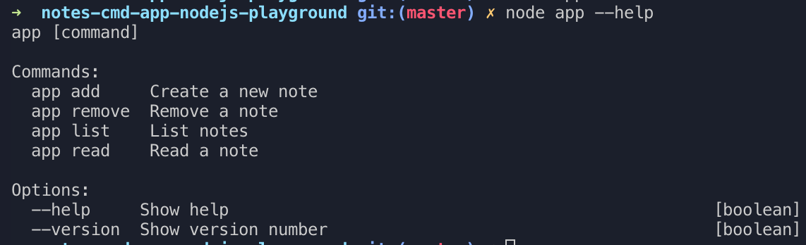

# Notes Command App 📝

Experiences with command lines using NodeJS

## Features 🐌

- [x] Create/Remove/List/Read.
- [x] Using file to store notes.

## Up & Running 🏃‍♂️

1. Run `npm install`.
2. Play with APIs

- To create a note `node app add "Note 1" "Just for fun"`
- To remove a note `node app remove "Note 1"`
- To list a note `node app list`
- To read body of a note `node app read "Note 1"`

3. Delete data file (if had one) `npm run delete`

## Test

- Run `npm test`
