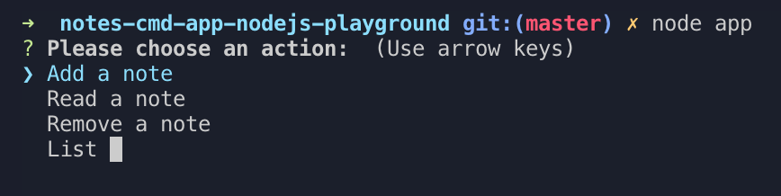

# Notes Command App 📝

Experiences with command lines using NodeJS

## Features 🐌

- [x] Create/Remove/List/Read.
- [x] Using file to store notes.
- [x] Build command line UI with `inquirer` and `commander` library.
- [ ] Add Unit test.

## Up & Running 🏃‍

1. Run `npm install`.
2. Run `npm start` or `node app` to see the main menu.
3. Also, play with APIs

- To create a note `node app add`
- To remove a note `node app remove`
- To list a note `node app list`
- To read body of a note `node app read`

4. Delete data file (if had one) `npm run delete`

## Test 🌡
